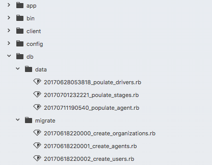

# Data Migrate

- [](https://rubygems.org/gems/data_migrate)
- [](http://opensource.org/licenses/MIT)
- [](https://travis-ci.org/ilyakatz/data-migrate)
- [](https://houndci.com)

Run data migrations alongside schema migrations.

Data migrations are stored in `db/data`. They act like schema
migrations, except they should be reserved for data migrations. For
instance, if you realize you need to titleize all your titles, this
is the place to do it.



## Why should I use this?

With data-migrate you can generate your migrations for data as you would schema
in your regular work flow.

For setting tasks that don't require any intermediate AR activity, like
dev and test, you stick with `db:migrate`. For production and QA, you
change their scripts to `db:migrate:with_data`. Of course you want to
test your migration, so you have the choice of `db:migrate:with_data` or
`data:migrate` to just capture that data change.

## What does it do?

Data migrations are stored in `db/data`. They act like schema
migrations, except they should be reserved for data migrations. For
instance, if you realize you need to titleize all yours titles, this
is the place to do it. Running any of the provided rake tasks also
creates a data schema table to mirror the usual schema migrations
table to track all migrations.

## Rails Support

Support Rails 6.0 through 7.0


#### v1

If you've installed previous to v1.1.0, you'll want to delete the
`create_data_migrations_table` migration.

## Installation

Add the gem to your project

    # Gemfile
    gem 'data_migrate'

Then `bundle install` and you are ready to go.

So you know, when you use one of the provide rake tasks, a table
called `data_migrations` will be created in your database. This
is to mirror the way the standard `db` rake tasks work.

## Usage

### Generating Migrations

You can generate a data migration as you would a schema migration:

    rails g data_migration add_this_to_that

### Rake Tasks

    $> rake -T data
    rake data:abort_if_pending_migrations          # Raises an error if there are pending data migrations
    rake data:dump                                 # Create a db/data_schema.rb file that stores the current data version
    rake data:forward                              # Pushes the schema to the next version (specify steps w/ STEP=n)
    rake data:migrate                              # Migrate data migrations (options: VERSION=x, VERBOSE=false)
    rake data:migrate:down                         # Runs the "down" for a given migration VERSION
    rake data:migrate:redo                         # Rollbacks the database one migration and re migrate up (options: STEP=x, VERSION=x)
    rake data:migrate:status                       # Display status of data migrations
    rake data:migrate:up                           # Runs the "up" for a given migration VERSION
    rake data:rollback                             # Rolls the schema back to the previous version (specify steps w/ STEP=n)
    rake data:schema:load                          # Load data_schema.rb file into the database without running the data migrations
    rake data:version                              # Retrieves the current schema version number for data migrations
    rake db:abort_if_pending_migrations:with_data  # Raises an error if there are pending migrations or data migrations
    rake db:forward:with_data                      # Pushes the schema to the next version (specify steps w/ STEP=n)
    rake db:migrate:down:with_data                 # Runs the "down" for a given migration VERSION
    rake db:migrate:redo:with_data                 # Rollbacks the database one migration and re migrate up (options: STEP=x, VERSION=x)
    rake db:migrate:status:with_data               # Display status of data and schema migrations
    rake db:migrate:up:with_data                   # Runs the "up" for a given migration VERSION
    rake db:migrate:with_data                      # Migrate the database data and schema (options: VERSION=x, VERBOSE=false)
    rake db:rollback:with_data                     # Rolls the schema back to the previous version (specify steps w/ STEP=n)
    rake db:schema:load:with_data                  # Load both schema.rb and data_schema.rb file into the database
    rake db:structure:load:with_data               # Load both structure.sql and data_schema.rb file into the database
    rake db:version:with_data                      # Retrieves the current schema version numbers for data and schema migrations


Tasks work as they would with the 'vanilla' db version. The 'with_data' addition to the 'db' tasks will run the task in the context of both the data and schema migrations. That is, rake db:rollback:with_data will check to see if it was a schema or data migration invoked last, and do that. Tasks invoked in that space also have an additional line of output, indicating if the action is performed on data or schema.

With 'up' and 'down', you can specify the option 'BOTH', which defaults to false. Using true, will migrate both the data and schema (in the desired direction) if they both match the version provided. Again, going up, schema is given precedence. Down its data.

`rake db:migrate:status:with_data` provides and additional column to indicate which type of migration.

### Configuration

`data_migrate` respects `ActiveRecord::Base.dump_schema_after_migration`. If it is set to `false`, data schema file will not be generated

By default, data migrations are added to the `db/data/` path.
You can override this setting in `config/initializers/data_migrate.rb`

```ruby
DataMigrate.configure do |config|
  config.data_migrations_path = 'db/awesomepath/'
  config.data_template_path = Rails.root.join("lib", "awesomepath", "custom_data_migration.rb")
  config.db_configuration = {
    'host' => '127.0.0.1',
    'database' => 'awesome_database',
    'adapter' => 'mysql2',
    'username' => 'root',
    'password' => nil,
  }
  config.spec_name = 'primary'
end

```

## Capistrano Support

The gem comes with a capistrano task that can be used instead of `capistrano/rails/migrations`.

Just add this line to your Capfile:

```ruby
require 'capistrano/data_migrate'
```

From now on capistrano will run `rake db:migrate:with_data` in every deploy.

## Rails Engines support

This gem also has a initial support for adding data migrations inside Rails engines.
Inside the Engine's class initializer (the one that inherits from `Rails::Engine`, usually inside `engines/ENGINE_NAME/lib/engine.rb`) you need to add something like this:


```ruby
module EngineName
  class Engine < ::Rails::Engine
    initializer :engine_name do |app|
      ::DataMigrate.configure do |data_migrate|
        default_path = ::DataMigrate::Config.new.data_migrations_path
        data_migrate.data_migrations_path = [default_path, root.join('db', 'data')]
      end
    end
  end
end
```

Then, in the Engine's `db/data` folder, you can add data migrations and run them as usual.

### Contributing

## Testing

Run tests for a specific version of Rails

```
bundle exec appraisal install
bundle exec appraisal rails-6.0 rspec
bundle exec appraisal rails-6.1 rspec
bundle exec appraisal rails-7.0 rspec
```

## Thanks

[Andrew J Vargo](http://github.com/ajvargo) Andrew was the original creator and maintainer of this project!

[Jeremy Durham](http://jeremydurham.com/) for fleshing out the idea and providing guidance.

You! Yes, you. Thanks for checking it out.
